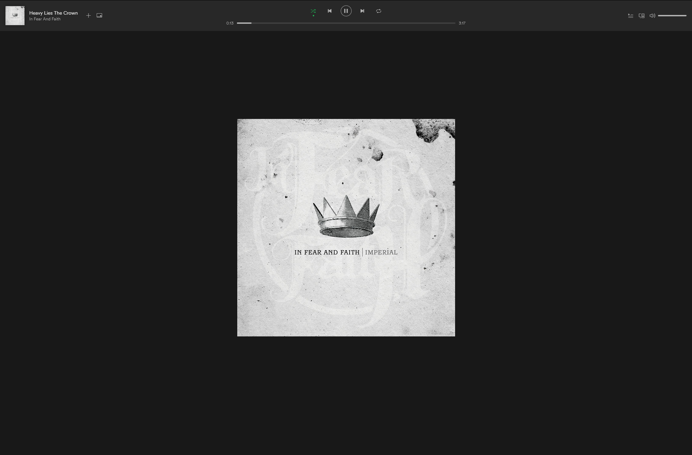
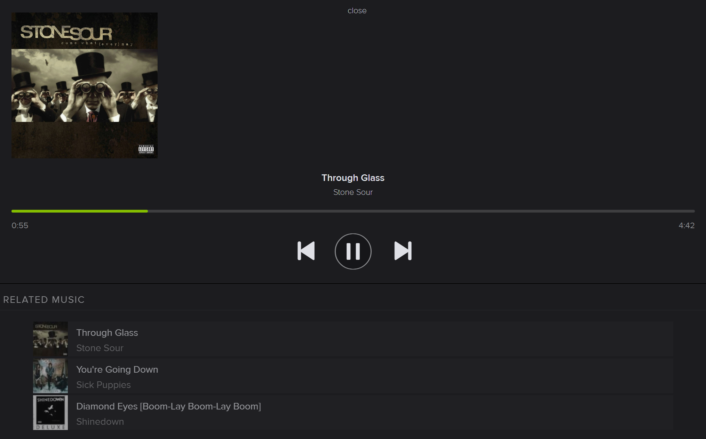

# Spotify webplayer fullscreen
Modifies the Spotify web player for an improved chromecast look. :green_heart:

Note: In 2019 there is a chromecast receiver application for Spotify that looks very good and can be used instead. This was probably not the case in 2017. Anyways, if you want to enjoy a cleaner look on a desktop this can be used there as well.

#### Installation
Install by browsing to [play.spotify.com](http://play.spotify.com) and entering "javascript:" in the address bar followed by the [script](https://github.com/codingchili/spotify-chromecast-fullscreen/blob/master/spotify.webplayer.modify-2019.4.js) in this repository.

Alternatively, hit F12 and paste the script into the console.

Supported browsers: CHROME

#### Instructions
- To enter chromecast mode press the Spotify logo in the upper left corner.
- To exit chromecast mode press album art.

Sample picture from Apr 2019

Sample picture from 2017

# Contributions
All ideas are welcome. :cat:
